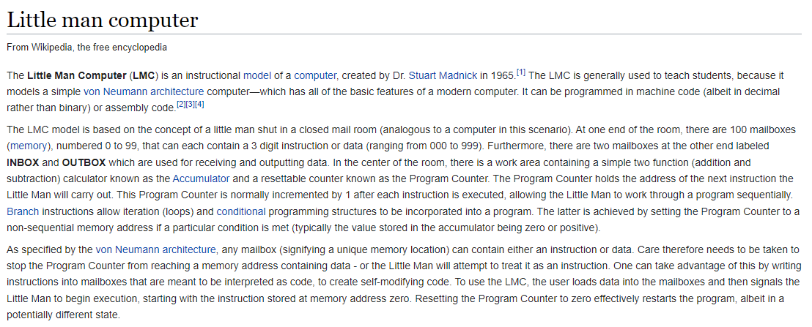
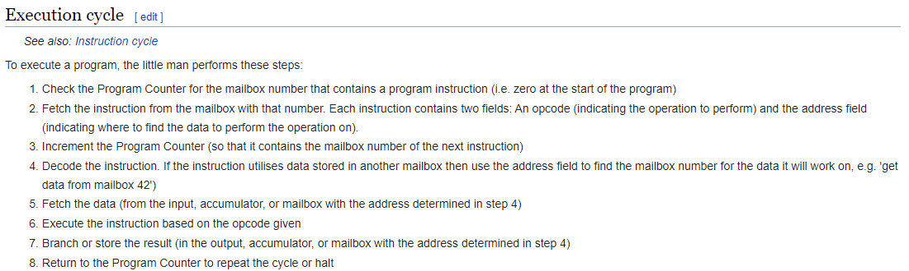
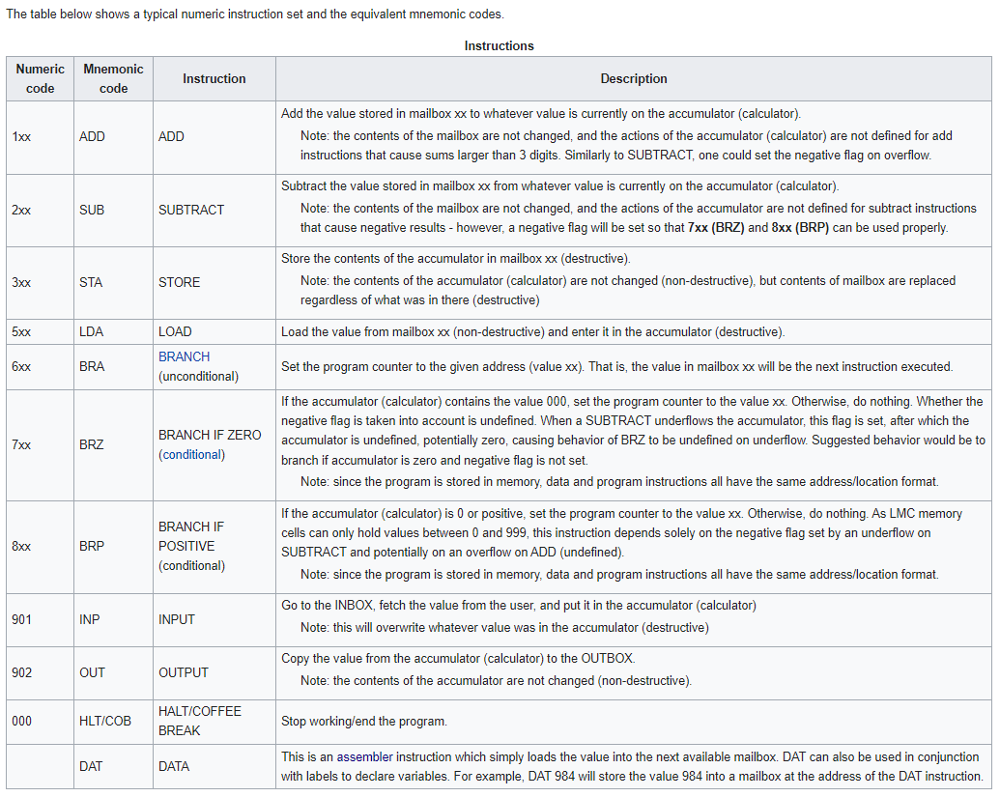
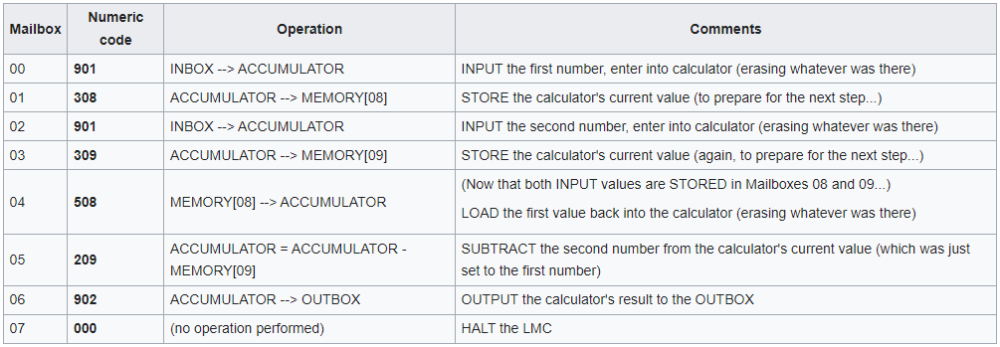
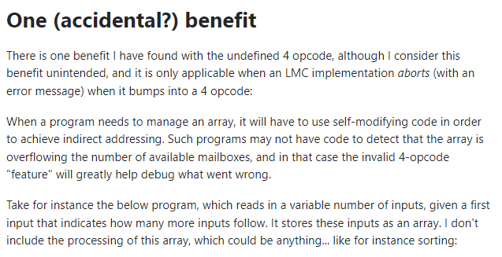
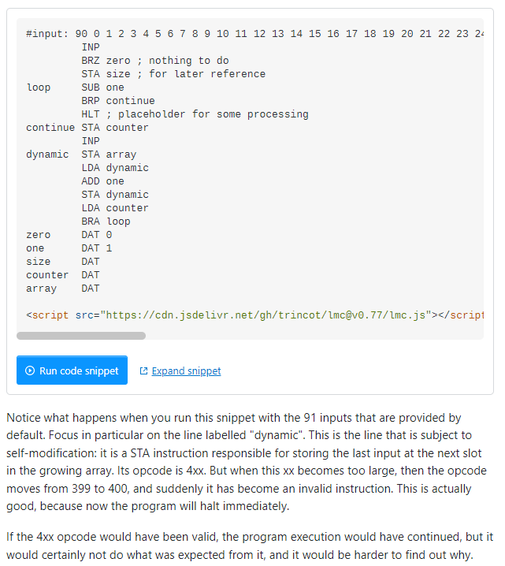

# LittleManComputer
Assembler and Interpreter for the LittleManComputer Code written in C

## Build
- *Linux:*
	  - Run `./build.sh`
	  - Output: `bin/lma`, `bin/lmc`
- *Windows:*
	  - Run `build.bat`
	  - Output: `bin/lma.exe`, `bin/lmc.exe`

# Assembler
- Comments
	- `;` Line comment
	- `/` Line comment
- Instructions
	- ADD
	- SUB
	- STA
	- LDA
	- BRA
	- BRZ
	- BRP
	- INP
	- OUT
	- HLT | COB
	- DAT

# Using

# Wiki

# Arrays? Where is opcode 4xx?

References:
- https://en.wikipedia.org/wiki/Little_man_computer
- https://stackoverflow.com/questions/42579740/what-happens-to-instructions-given-to-the-little-man-in-the-lmc-that-begin-with
