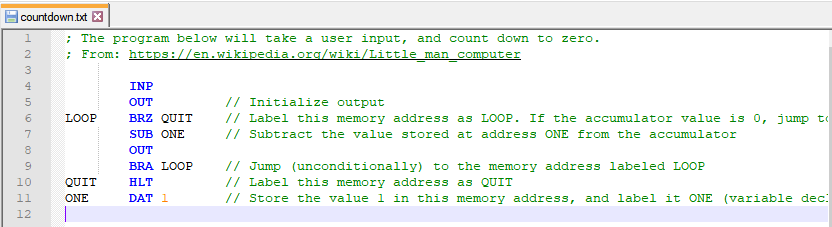

# LittleManComputer
Assembler and Interpreter for the LittleManComputer Code written in C

# Installation
- *Windows:*
	- Download [lmc.zip](bin)
	- Extract it anywhere
	- Add the folder to the PATH ([howto](https://windowsloop.com/how-to-add-to-windows-path/))
	- Open CMD and type `lmc` to verify installation
- *Linux:*
	- Download [lmc.tar.gz](bin)
	- Extract it anywhere (`tar xf lmc_X.X.tar.gz -C lmc`)
	- Run `./setup.sh`
	- Type `lmc` to verify installation

# Build
- *Windows:*
	- Run `build.bat`
	- Output: `bin\lma.exe`, `bin\lmc.exe`
	- Requirements: [tcc for windows](http://download.savannah.gnu.org/releases/tinycc/)
- *Linux:*
	- Run `./build.sh`
	- Output: `bin/lma`, `bin/lmc`
	- Requirements: `apt install tcc`

# Assembler
- Comments
	- `;` Line comment
	- `/` Line comment
- Instructions
	- ADD
	- SUB
	- STA
	- LDA
	- BRA
	- BRZ
	- BRP
	- INP
	- OUT
	- HLT | COB
	- DAT

# Using

# Wiki

# Arrays? Where is opcode 4xx?

References:
- https://en.wikipedia.org/wiki/Little_man_computer
- https://stackoverflow.com/questions/42579740/what-happens-to-instructions-given-to-the-little-man-in-the-lmc-that-begin-with
